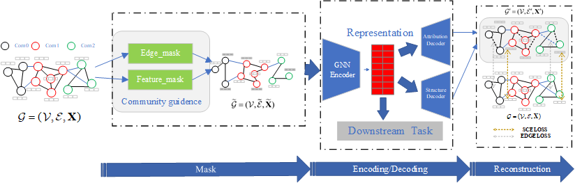
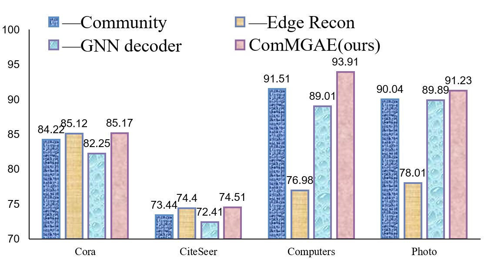

# ComMGAE：Community Aware Masked Graph Autoencoder

  
   

The code is based on the implementation of [GraphMAE](https://github.com/THUDM/GraphMAE) and [CSGCL](https://github.com/HanChen-HUST/CSGCL)

    

        
    

   

# Dependencies
* Python 3.9
* torch 11.6
* PyTorch 1.13.0
* dgl 1.1.1
* cdlib 0.2.6
* networkx 2.5.1
* numpy 1.23

Other specific dependencies can be found in the environment.yml

# Quick Start
## Clone code 
~~~shell
cd ~/home
git clone https://github.com/jiang-cmyk/ComMGAE
cd ComMGAE
~~~

## Reproduce the environment
~~~conda
conda env create -f environment.yml
~~~

## Start training
Train the model with the best parameters for node classification
~~~shell
python main.py --dataset Cora --param local.json --cfg
~~~
You can change the parameter in the train files (NOT RECOMMENDED)

# Result
Comparative experiment on the node calssification task

|            | Method | Cora  | CiteSeer | Arxiv | Computers | Photo |
|------------|---|:---:|:---:|:---:|:---:|:---:|
| Supervised | GCN   | 81.50±0.20 | 70.30±0.40 | 70.40±0.30 | 86.51±0.54 | 92.42±0.22 |
|            | GAT   | 83.00±0.20 | 72.50±0.70 | 70.60±0.30 | 86.93±0.29 | 92.56±0.35 |
| GCL        | DGI   | 82.30±0.60 | 71.80±0.70 | 65.10±0.40 | 83.95±0.47 | 91.61±0.22 |
|            | GRACE | 81.90±0.40 | 71.20±0.50 | 68.70±0.40 | 86.25±0.25 | 92.15±0.24 |
|            | GCA   | 81.80±0.20 | 71.90±0.40 | 68.20±0.20 | 87.85±0.31 | 92.53±0.16|
|            | CCA-SSG | 84.00±0.40 | 73.10±0.30 | 52.55±0.10 | 88.74±0.28 | 93.14±0.14|
| GAE        | GAE | 71.50±0.40 | 65.80±0.40 | 63.60±0.50 | 85.10±0.40 | 91.00±0.10 |
|            | VGAE  | 76.30±0.20 | 66.80±0.20 | 64.80±0.20 | 85.80±0.30 | 91.50±0.20 |
|            | MaskGAE | 84.05±0.18 | 73.49±0.59 | 70.73±0.30 | 89.01±0.34 | 92.89±0.18 |
|            | GraphMAE | 84.12±0.54 | 73.40±0.40 | 71.75±0.17 | 88.04±0.54 | 92.43±0.16 |
|            | **ComMGAE(ours)** | __85.17±0.53__ | __74.51±0.41__ | __72.03±0.11__ | __89.80±0.14__ | __93.22±0.26__|
